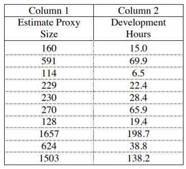
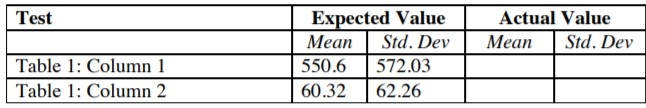
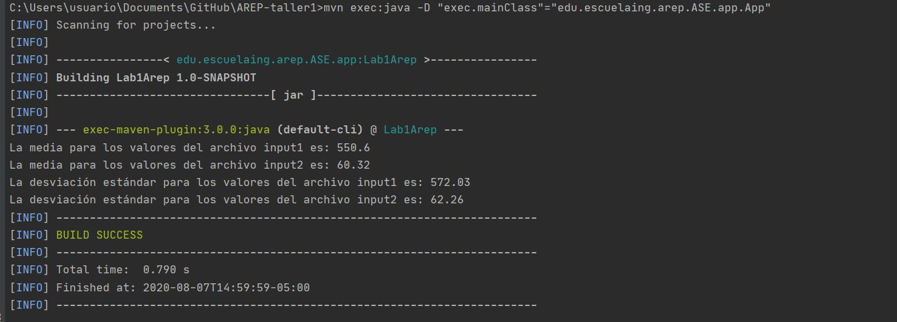

# AREP-Laboratorio 1- Ejercicio Mvn-Git

El objetivo de este laboratorio crear un programa para calcular la media y 
la desviación estándar de n números reales que se leen a un archivo.

Para esto se creó una implementación propia de una LinkedList y un módulo
de estadísticas. Los detalles del diseño se pueden encontrar en el  documento [LabMvnGit.pdf](LabMvnGit.pdf)

En la siguiente tabla se presentan los valores con los que se
probará la implementación, los valores de la columna 1 se encuentran
en el archivo cases\input1 mientras que la columna 2 en el archivo 
cases\input2



Los valores esperados se presentan a continuación


Finalmente, estos fueron los resultados obtenidos al 
ejecutar el problema con estos valores




## Pre-requisitos
* [Maven](https://maven.apache.org/) - Administrador de dependencias
* [Git](https://git-scm.com/) - Sistema de control de versiones 

## Instrucciones de uso

Para descargar el proyecto se debe usar 
```
git clone https://github.com/Jcro15/AREP-taller1.git
```

Una vez descargado el proyecto este debe compilarse con la siguiente instrucción

```
mvn package 
```

Para ejecutar la aplicación se debe usar el comando 

```
mvn exec:java -D "exec.mainClass"="edu.escuelaing.arep.ASE.app.App"
```

Para ejecutar las pruebas del proyecto se debe usar el comando
```
mvn test
```
La documentación se puede encontrar en la carpeta Javadoc o puede generarse en 
la ubicación target\site\apidocs\index.html utilizando el comando
```
mvn javadoc:javadoc
```

Si se desea calcular la media y la desviación estándar de otro conjunto de datos
estos pueden colocarse en alguno de los archivos cases\input1.txt o en cases\input2.txt

## Construido con

* [Maven](https://maven.apache.org/) - Administrador de dependencias
* [Junit](https://junit.org/junit5/) - Framework para pruebas en java

## Autor

* **Juan Camilo Rojas Ortiz** - *Estudiante de ingeniería de sistemas* 

## Licencia

Este proyecto esta bajo la licencia GNU(General Public License) los detalles se pueden encontrar en el archivo [LICENSE](LICENSE)

